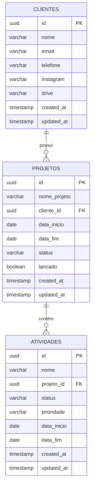

# 📊 Diagrama Entidade-Relacionamento (ER)
## Sistema Para Freelancers

---

## Diagrama ER - Mermaid



---

## Diagrama Visual Simples

```
┌──────────────────────────────┐
│        CLIENTES              │
├──────────────────────────────┤
│ 🔑 id (UUID) PK              │
│ 📝 nome                      │
│ 📧 email                     │
│ 📱 telefone                  │
│ 📸 instagram                 │
│ 💾 drive                     │
│ 🕐 created_at                │
│ 🕐 updated_at                │
└───────────┬──────────────────┘
            │
            │ 1:N
            │ "Um cliente possui vários projetos"
            │
┌───────────▼──────────────────┐
│         PROJETOS             │
├──────────────────────────────┤
│ 🔑 id (UUID) PK              │
│ 📝 nome_projeto              │
│ 🔗 cliente_id (FK)           │
│ 📅 data_inicio               │
│ 📅 data_fim                  │
│ 📊 status                    │
│    ├─ Não iniciado           │
│    ├─ Em andamento           │
│    └─ Concluído              │
│ ✅ lancado                   │
│ 🕐 created_at                │
│ 🕐 updated_at                │
└───────────┬──────────────────┘
            │
            │ 1:N
            │ "Um projeto contém várias atividades"
            │
┌───────────▼──────────────────┐
│        ATIVIDADES            │
├──────────────────────────────┤
│ 🔑 id (UUID) PK              │
│ 📝 nome                      │
│ 🔗 projeto_id (FK)           │
│ 📊 status                    │
│    ├─ Não iniciada           │
│    ├─ Em andamento           │
│    └─ Concluído              │
│ 🎯 prioridade                │
│    ├─ Baixa                  │
│    ├─ Média                  │
│    └─ Alta                   │
│ 📅 data_inicio               │
│ 📅 data_fim                  │
│ 🕐 created_at                │
│ 🕐 updated_at                │
└──────────────────────────────┘
```

---

## Cardinalidades

### Relação: CLIENTES → PROJETOS
- **Tipo**: Um para Muitos (1:N)
- **Descrição**: Um cliente pode ter vários projetos, mas cada projeto pertence a apenas um cliente
- **FK**: `projetos.cliente_id` → `clientes.id`
- **Deleção**: `ON DELETE SET NULL` (projeto fica órfão, não é deletado)

### Relação: PROJETOS → ATIVIDADES
- **Tipo**: Um para Muitos (1:N)
- **Descrição**: Um projeto pode conter várias atividades, mas cada atividade pertence a apenas um projeto
- **FK**: `atividades.projeto_id` → `projetos.id`
- **Deleção**: `ON DELETE CASCADE` (atividades são deletadas junto com o projeto)

---

## Fluxo de Dados

```
1. Cadastro de Cliente
   └─> Cliente criado em CLIENTES

2. Criação de Projeto
   └─> Projeto criado em PROJETOS
       └─> Vinculado ao cliente via cliente_id

3. Criação de Atividades
   └─> Atividades criadas em ATIVIDADES
       └─> Vinculadas ao projeto via projeto_id

4. Consulta Completa
   └─> JOIN: ATIVIDADES → PROJETOS → CLIENTES
       └─> Retorna: Atividade + Projeto + Cliente
```

---

## Constraints de Integridade

### CLIENTES
- ✅ `id` → Chave primária (UUID)
- ✅ `nome` → NOT NULL

### PROJETOS
- ✅ `id` → Chave primária (UUID)
- ✅ `nome_projeto` → NOT NULL
- ✅ `cliente_id` → FK para CLIENTES (opcional)
- ✅ `status` → CHECK IN ('Não iniciado', 'Em andamento', 'Concluído')
- ✅ `lancado` → DEFAULT FALSE

### ATIVIDADES
- ✅ `id` → Chave primária (UUID)
- ✅ `nome` → NOT NULL
- ✅ `projeto_id` → FK para PROJETOS (opcional)
- ✅ `status` → CHECK IN ('Não iniciada', 'Em andamento', 'Concluído')
- ✅ `prioridade` → CHECK IN ('Baixa', 'Média', 'Alta')

---

## Índices Implementados

### Performance de Consultas

```sql
-- CLIENTES
CREATE INDEX idx_clientes_email ON clientes(email);
CREATE INDEX idx_clientes_nome ON clientes(nome);

-- PROJETOS
CREATE INDEX idx_projetos_cliente_id ON projetos(cliente_id);
CREATE INDEX idx_projetos_status ON projetos(status);
CREATE INDEX idx_projetos_data_fim ON projetos(data_fim);

-- ATIVIDADES
CREATE INDEX idx_atividades_projeto_id ON atividades(projeto_id);
CREATE INDEX idx_atividades_status ON atividades(status);
CREATE INDEX idx_atividades_prioridade ON atividades(prioridade);
CREATE INDEX idx_atividades_data_fim ON atividades(data_fim);
```

**Justificativa dos Índices:**
- 🔍 Busca por email e nome de clientes (comum em pesquisas)
- 🔗 FK indexes para otimizar JOINs
- 📊 Status para filtros de dashboard
- 📅 Datas para consultas de prazos e deadlines
- 🎯 Prioridade para filtros de atividades

---

## Views Relacionais

### 1. vw_projetos_clientes
**Combina**: PROJETOS + CLIENTES

```sql
SELECT 
    projeto.*,
    cliente.nome,
    cliente.email,
    situacao_prazo,
    dias_restantes
FROM projetos
LEFT JOIN clientes ON projetos.cliente_id = clientes.id
```

### 2. vw_atividades_completas
**Combina**: ATIVIDADES + PROJETOS + CLIENTES

```sql
SELECT 
    atividade.*,
    projeto.nome_projeto,
    cliente.nome AS cliente_nome
FROM atividades
LEFT JOIN projetos ON atividades.projeto_id = projetos.id
LEFT JOIN clientes ON projetos.cliente_id = clientes.id
```

### 3. vw_estatisticas_clientes
**Agrega**: Contagens de projetos por cliente

```sql
SELECT 
    cliente.*,
    COUNT(projetos) AS total_projetos,
    COUNT por status
FROM clientes
LEFT JOIN projetos ON clientes.id = projetos.cliente_id
GROUP BY cliente.id
```

---

## Exemplo de Consulta Completa

### Buscar todas as atividades de alta prioridade com contexto completo

```sql
SELECT 
    a.nome AS atividade,
    a.status AS status_atividade,
    a.prioridade,
    a.data_fim,
    p.nome_projeto,
    p.status AS status_projeto,
    c.nome AS cliente,
    c.email,
    c.telefone,
    CASE 
        WHEN a.data_fim < CURRENT_DATE THEN 'ATRASADA'
        WHEN a.data_fim = CURRENT_DATE THEN 'VENCE HOJE'
        ELSE 'NO PRAZO'
    END AS situacao
FROM atividades a
INNER JOIN projetos p ON a.projeto_id = p.id
INNER JOIN clientes c ON p.cliente_id = c.id
WHERE a.prioridade = 'Alta'
  AND a.status != 'Concluído'
ORDER BY a.data_fim ASC;
```

---

## Políticas de Deleção

### Cenário 1: Deletar Cliente
```sql
DELETE FROM clientes WHERE id = 'uuid-do-cliente';
```
**Resultado:**
- ✅ Cliente deletado
- ✅ Projetos permanecem (cliente_id → NULL)
- ✅ Atividades permanecem (ligadas aos projetos)

### Cenário 2: Deletar Projeto
```sql
DELETE FROM projetos WHERE id = 'uuid-do-projeto';
```
**Resultado:**
- ✅ Projeto deletado
- ✅ Cliente permanece
- ❌ Atividades deletadas (CASCADE)

### Cenário 3: Deletar Atividade
```sql
DELETE FROM atividades WHERE id = 'uuid-da-atividade';
```
**Resultado:**
- ✅ Atividade deletada
- ✅ Projeto permanece
- ✅ Cliente permanece

---

## Regras de Negócio Implementadas

1. ✅ **Cliente** pode existir sem projetos
2. ✅ **Projeto** pode existir sem cliente (órfão)
3. ✅ **Projeto** não pode existir sem ser criado
4. ✅ **Atividade** é sempre vinculada a um projeto
5. ✅ **Atividade** é deletada se o projeto for deletado
6. ✅ **Status** deve ter valor válido (constraint CHECK)
7. ✅ **Prioridade** deve ter valor válido (constraint CHECK)
8. ✅ **Timestamps** são atualizados automaticamente

---

## 🎨 Legenda do Diagrama

| Símbolo | Significado |
|---------|-------------|
| 🔑 | Chave Primária (PK) |
| 🔗 | Chave Estrangeira (FK) |
| 📝 | Campo de texto |
| 📧 | E-mail |
| 📱 | Telefone |
| 📸 | URL / Link |
| 💾 | Armazenamento |
| 📅 | Data |
| 📊 | Status / Enum |
| 🎯 | Prioridade |
| ✅ | Boolean / Checkbox |
| 🕐 | Timestamp |
| ||--o{ | Relação 1:N (um para muitos) |

---

**📐 Diagrama criado baseado na estrutura do Notion - Sistema Para Freelancers**
